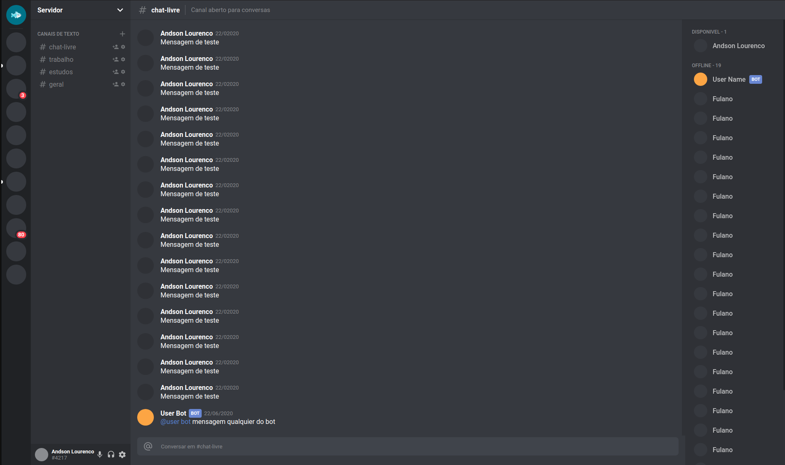

# Clone interface do Discord

Projeto usado para estudos do react e styled component.


## stack 

```
- react
- typescript
- styled-components
- styled-icons
```

## Iniciando projeto

iniciando fazendo o clone do projeto. 

instalando as dependências.
`` yarn``

iniciando o projeto em modo de desenvolvimento.

`` yarn start ``

buildando o projeto para produção.

`` yarn build ``

## Prévia




creditos: <a href="https://www.youtube.com/watch?v=x4FdZd2-_uU&t=2446s">Rocketseat</a>